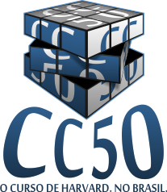

Daily Learning

## Solutions for CC50/CS50 problem sets.
> CC50 is a Portuguese adaptation of the CS50 course at Harvard.

  

“Demanding, but definitely doable. Social but educational. A topic focused on widely applicable skills. CS50 is the quintessential Harvard course, and CC50 is the free adaptation of this course in Brazil.”

#### About
Introduction to the intellectual faculties of computer science and the art of programming. This course teaches students to think algorithmically and efficiently solve problems. Topics include:
- abstraction,
- encapsulation,
- data structures,
- databases,
- memory management,
- software development,
- virtualization,
- and websites.

Languages ​​include:
- C,
- PHP,
- JavaScript,
- SQL plus,
- CSS,
- and XHTML.

Problem Sets inspired by the real world: domains of biology, cryptography, finance, forensic science, and games. Designed for anyone interested, with or without prior programming experience.

#### Links
- [CC50 in Portuguese](https://cc50.com.br)
- [original CS50](https://www.cs50.net)
- [LICENSE](./LICENSE) 
